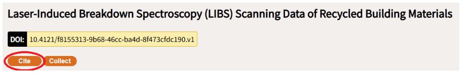
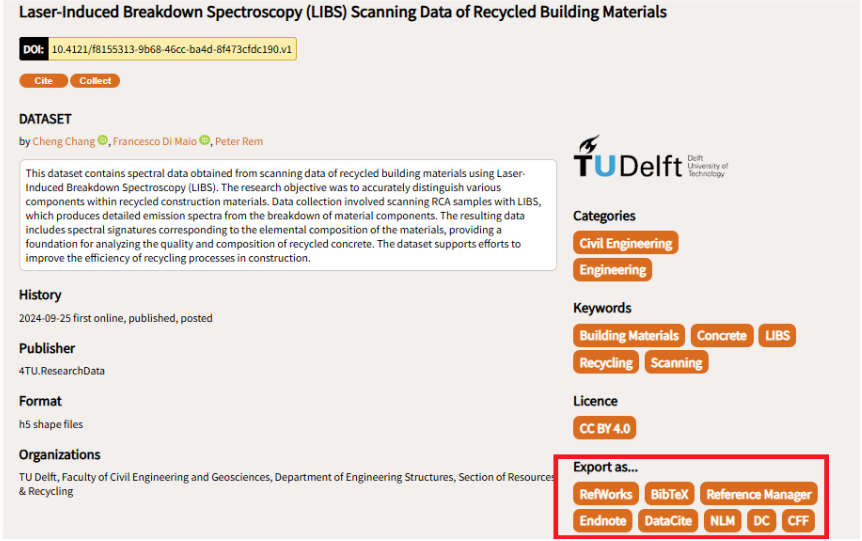

# Citing Data

Now that you've uploaded your research data, software, and code, it's crucial to understand how to ensure proper citation and maximize the impact of your work.

To cite any content on 4TU.ResearchData you need to select the citation text in the *Cite* section under the title, and use the Copy function in your browser. 

You can also export the citation to [RefWorks](https://refworks.proquest.com/), [BibTeX](https://www.bibtex.org/), [RefMan](https://github.com/adriancaruana/refman), [Endnote](https://endnote.com/), [DataCite](https://datacite.org/), [NLM](https://www.citethisforme.com/citation-generator/national-library-of-medicine-grant-proposals), [DC](https://www.dublincore.org/specifications/dublin-core/dc-citation-guidelines/) and [CFF](https://citation-file-format.github.io/). These are available in the side pane (to the right) of every dataset page.

Specifically for software and code, 4TU.ResearchData supports the Citation File Format (CFF), a standardized format and schema for software citation metadata files (CITATION.cff). Developers and software engineers can include them in their repositories to let others know how to correctly cite their software. 

## Why does citation matter?

By depositing your research outputs in 4TU.ResearchData, you've already taken a significant step towards open science and making your work [FAIR](/introduction/fair_data_and_software). Each dataset you've uploaded receives a unique [Digital Object Identifier (DOI)](https://www.doi.org/), creating a permanent, stable link that allows others to consistently refer to your work.

## Citation Best Practices 

Your research data has greater chances of being cited if you: 

- Always provide a comprehensive README file describing your dataset
- Select an appropriate Creative Commons licence (CC0 is the default)
- Ensure your metadata is complete, including:
    - Discipline/research field
    - Funding information
    - Potential linked publications

Example citation:

Chang, Cheng; Di Maio, Francesco; Rem, Peter (2024): Laser-Induced Breakdown Spectroscopy (LIBS) Scanning Data of Recycled Building Materials. Version 1. 4TU.ResearchData. dataset. https://doi.org/10.4121/f8155313-9b68-46cc-ba4d-8f473cfdc190.v1

## What are the benefits of proper data citation? 

For you as a data producer, proper citation:

- Provides attribution and credit.
- Creates a bibliographic "trail" connecting your publications and data.
- Demonstrates the impact of your research.
- Establishes your research data as a scholarly contribution.

4TU.ResearchData makes citation easy by:

- Providing ready-to-use citation text.
- Offering export options to various reference management systems.
- Supporting citations at different levels of detail (entire collection or individual components).

Remember: Even if your chosen licence doesn't legally require citation, it's considered good scientific practice. Proper citation helps avoid potential plagiarism and enhances the credibility of your research.

