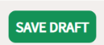

# Submission Review Process 

Submitting your data to 4TU.ResearchData offers a unique advantage: curation by a real person. This human touch ensures that the metadata is accurate and appropriate, and that the related documentation is well-organized, aligning with [FAIR](/introduction/fair_data_and_software) principles.

This personalized guidance helps you learn best practices for data publishing, ultimately increasing your research impact. The curator also ensures your submission adheres to 4TU.ResearchData's [metadata](#metadata-review-process-checklist) quality standards and policies.

The curator conducts a meticulous check of file formats, metadata quality, and overall completeness. Please note that the review will not address the core scientific analysis, methodologies or conclusions behind the submitted data.

Throughout the review process, the curator may contact you directly to ask for clarification and/or suggest changes to your metadata, with a view to making it more findable by other researchers. Please reply in a timely fashion. Your submission will remain a draft and will not be published until you have made and/or approved any changes suggested by the curator.  

The review is normally complete within 3 working days. You will then receive detailed feedback via email researchdata@4tu.nl, including suggestions to enhance your submission's visibility and reusability. 

This human-centered approach not only improves the quality of your data but also provides a valuable learning experience in research data management. By leveraging this expert curation service, you're ensuring your research data is not just stored but truly prepared for long-term preservation and reuse by the wider scientific community.

**Watch this video for more information on the data curation process**

*N.B. Please note that some aspects of the submission interface have changed since this video was originally produced.*

    <iframe src="https://www.youtube.com/embed/LOQdDzv-5sM" allowfullscreen="allowfullscreen" allow="autoplay *; geolocation *; microphone *; camera *; midi *; encrypted-media *"></iframe>

## Metadata Review Process Checklist

### Dataset Details

- **✅Title:**
    - ✅Is the title findable and reflective of the dataset content?
        - Avoid vague titles like "Dataset" or "Control Data".
    - ✅Does it indicate if the upload is data or software?
        - E.g.: "Data underlying" or "Code for" or "Matlab script for".

- **✅Author:**
    - ✅Are all contributing authors included?
        - Use ORCiDs, personal names, or institutional names.
    - ✅Ensure all authors who contributed to the dataset are listed.
        - Note: this maybe differ from publication authors.
    
- **✅Description:**
    - ✅Is there a short paragraph describing the dataset or software?
    - ✅Is the research aim, data collection method, and data type included?
        - Note: you can use the Abstract of your published article but remember that your dataset is a separate research output and may need a unique description.
    - ✅Have you described what the data is about?
        - Note: It is NOT enough to state where the data comes from.

### [Licence](/submission_workflow/choosing_a_licence)

- **✅ Open-Access:**
    - ✅ Have you chosen the correct licence from the drop-down menu?
        - The default is CC0.
        - To what extent do you want your data to be reused?

- **✅[Embargoed Access:](/submission_workflow/setting_access_levels)**
    - ✅Specify the embargo date.
    - ✅ State a reason for the embargo.

- **✅Restricted Access:**
    - ✅Specify the conditions for sharing the dataset.
    - ✅State a reason for restricted access.
    - ✅Is there an end user licence agreement (EULA)? See example [here](https://data.4tu.nl/s/documents/4TU.ResearchData_EULA_Sept.2024.pdf).
    -     
- **✅Software Licence:**
    - ✅Choose an appropriate licence for software.
    - ✅If software and dataset are submitted together, include the chosen software licence in the README.

**Categories**
- ✅**Main and Sub-category:**
    - ✅Choose at least one main and one sub-category from the [ANZSRC]( https://www.abs.gov.au/statistics/classifications/australian-and-new-zealand-standard-research-classification-anzsrc/latest-release) Fields of Research.
    - ✅Consider picking more categories to improve findability.
    - ✅Check relevant categories on the ANZSRC site if you are in doubt.

- **✅Group:**
    - ✅This is auto-filled based on the uploader's email.

- **✅Publisher:**
    - ✅The default is always 4TU.ResearchData.

- **✅Funding Information:**
    - ✅Add information about research funding.
    - ✅MINIMUM information required: the funder's name.
    - ✅*If applicable, include the grant number and grant provider's details.*

### Linked Resources & References

- **✅Resource Title:**
    - ✅Include the title of the peer-reviewed article or research.
- **✅Resource [DOI](/citing_data/dois_and_persistent_identifiers):**
    - ✅Provide the DOI for the linked article.
    - ✅If there is no DOI, put the article/thesis link in the references field.
        - E.g.: if your submission is a Master's thesis.

- **✅References:**
    - ✅Avoid using ordinary URLs; use DOIs to ensure long term findability.

### Findability

- **✅Language:**
    - ✅The default language is English.
        - Amend the language setting as required.
- **✅Time Coverage:**
    - ✅Include dates or period of data collection. FORMAT options:
        - Year or starting year to end year separated by a "/"
            - Year-Month-Day: 2021-09-25/2024-01-05
            - Months: 2021-09/2024-01
            - Years: 2021/2024
        - Free format - e.g.: for a geological period.
        - Series of descrete points in time separated by a comma+space.
    - Note: this can be updated later - for example, if your research is not complete.

- **✅Geolocation:**
    - ✅Specify geographic area IF it is relevant to understanding the data.
        - Note: this is an optional field.
    - ✅When longitude and latitude are indicated, a link is generated.
        - Check accuracy using "preview" and "openstreetmap".

- **✅[File Format(s)](https://data.4tu.nl/s/documents/Preferred_File_Formats_2023.pdf):**
    - ✅Indicate formats for data sets and related files.
        - Note: it is enough to state file extensions.

- **✅Data Link:**
    - ✅Are there [NetCDF from OPENDaP](/submission_workflow/supported_file_formats) files?
        - If so, the curator will create a link on your behalf.

- **✅Derived From:**
    - ✅Provide sources from which the item was taken.
        - This might be the case if the dataset is already stored elsewhere.
        - Note: this field is NOT for the peer-reviewed article DOI (see above - Linked Resources & References)

- **✅Same As:**
    - ✅Include a URL redirecting to the data in another location if applicable.
    - ✅Please note: your data might note be accepted if you have submitted it to another repository which assigned it a DOI.

- **✅Keywords:**
    - ✅Choose at least 4 keywords to enhance finadability (More are better!)
    - ✅Ensure keywords describe the content.
    - ✅Look at keywords used in other relevant datasets.

- **✅Organizations:**
    - ✅Provide the names of contributing organizations. Format:
        - Institution / facility / department / research group
            - Format guide: largest to smallest.

### Files
- **✅Files:**
    - ✅Ensure the dataset or software and related files are uploaded (preferably in an archive format, e.g.: .zip)
    - ✅Include a [README](/submission_workflow/readme_and_documentation) as README.txt file, which is separate from your zipped data file. This way, researchers can download it separately and read it before downloading the entire dataset. 

### Terms and Agreement
- **✅Deposit Agreement:**
    - ✅Select "I agree with the [Deposit Agreement](https://data.4tu.nl/s/docs/deposit-agreement.pdf)." **It is highly recommended that you read this.**
    - ✅Select "I agree that my dataset will be published once the review is complete."

### Final Steps 

You must then go to the top of the page and click the grey tab: **Submit for Review**.
The submission **remains a draft and is not published** until the curator reviews it. 

Once you receive an email with suggestions, **please reply to approve the suggested changes** and/or make any necessary amendments. 

It is important to remember that your dataset or software will not be published in the repository until you have replied and approved the changes. 

[This link](https://data.4tu.nl/s/documents/Metadata_review_guidelines_June_2021.pdf) contains more information about what the curator pays attention to when reviewing the metadata of your submission. 
