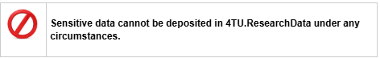

# Types of Access

Selecting the appropriate access level for datasets and software in 4TU.ResearchData is crucial, as it determines how others can interact with the research outputs. Researchers must carefully consider their obligations to research partners, especially those from the commercial sector, when making this decision.

**4TU.ResearchData offers four access levels:**

**1. Open Access:** The default option, allowing unrestricted viewing and downloading of data. This maximizes visibility and potential for reuse.

**2. Embargoed Access:** Temporarily restricts access for a specified period. This is useful when delaying publication is necessary, such as for patent filing or pending journal article publication. We recommend that researchers only place embargo access on files rather than on the entire upload. However, it is possible to place a full embargo on your data set or software. See below for examples.

**3. [Restricted Access](https://data.4tu.nl/s/documents/4TU.ResearchData_Restricted_Access_2023.pdf):** Limits access to authorized users only. Appropriate for [personal data](#personal--sensitive-data) that cannot be fully anonymized or when contractual obligations require controlled access. See below for examples. 

**4. Metadata-Only:** Creates a record with descriptive information but without the actual data files because data is stored securely elsewhere. More information is available [here]( https://communities.springernature.com/posts/metadata-only-records-what-are-they-and-why-are-they-useful?badge_id=269-springer-nature). 

These access levels are elaborated on in [page 4 of this document](https://data.4tu.nl/s/docs/data-collection-policy.pdf). 

## Metadata and Discoverability 

Regardless of the chosen access level, metadata is always openly accessible, ensuring discoverability of the research.

## Considerations when Choosing Access Level

When uploading, you should select an access level that balances openness with any necessary restrictions. Consider the nature of your data, any agreements you’ve made  with partners, and potential ethical or legal implications. By giving due attention to this choice, you can ensure your data is as open as possible while respecting your obligations.

### Example datasets

**Full Embargo**

[Data underlying the PhD thesis: Thermoelectric effects in quantum systems](https://data.4tu.nl/datasets/cdb42d77-6e0b-4132-8f26-2b560673b745)

**Embargo (files only)**

Vos, Darryl (2024): Data set - MSc thesis - Experimental research into the stability of crown walls on a rubble mound breakwater. Version 1. 4TU.ResearchData. https://doi.org/10.4121/72132255-292b-49c5-bd1d-fd81a007323f

Wu, Ziying; Chaykina, Diana; Schreuders, Herman; Schut, Henk; de Boer, Martijn et. al. (2024): Data underlying the Chapter "Time dependent evolution of vacancies and metallic domains and their correlation with the photochromic effect in yttrium oxyhydride films revealed by in-situ illumination positron annihilation lifetime spectroscopy". Version 1. 4TU.ResearchData. https://doi.org/10.4121/4d2ed4d1-5bd6-4bec-beb2-4adb78e61f9b

**Restricted Access**

(Note the End User’s Licence Agreement - EULA - at the bottom of each entry) 

Roldan, Ignacio; Pálffy, András; yuan, sen; Zhu, Simin ; Garzon Oviedo, Mario et. al. (2024): RaDelft Dataset: a large-scale, real-life, and multi-sensor automotive dataset. Version 5. 4TU.ResearchData. https://doi.org/10.4121/4e277430-e562-4a7a-adfe-30b58d9a5f0a

Raman, Chirag; Vargas Quiros, Jose; Tan, Stephanie; Islam, Ashraful; Gedik, Ekin et. al. (2022): Samples for ConfLab: A Rich Multimodal Multisensor Dataset of Free-Standing Social Interactions in the Wild. Version 2. 4TU.ResearchData. https://doi.org/10.4121/20017682 

In this case, the uploaders wanted the EULA recorded in a separate entry: 

Raman, Chirag; Vargas Quiros, Jose; Tan, Stephanie; Islam, Ashraful; Gedik, Ekin et. al. (2022): EULA for ConfLab: A Data Collection Concept, Dataset, and Benchmark for Machine Analysis of Free-Standing Social Interactions in the Wild. Version 2. 4TU.ResearchData. https://doi.org/10.4121/2001619

## [Personal & Sensitive Data](https://utrechtuniversity.github.io/dataprivacyhandbook/)
*(And what’s the difference)*

When uploading data to the 4TU.ResearchData Repository, researchers must distinguish between personal and sensitive data to comply with legal and ethical standards while fostering responsible research. The relevant standards relate to European data protection law and are encapsulated in the General Data Protection Regulation [GDPR](https://gdpr.eu/). Compliance with this law is required regardless of where your institution is based or where the research was conducted.

Personal data refers to any information identifying or potentially identifying a natural person, such as:

* Names, addresses, identification numbers
* Location data, online identifiers
* Characteristics expressing physical, physiological, genetic, mental, commercial, cultural, or social identity

Sensitive data is a [GDPR](https://gdpr.eu/)-defined subcategory of personal data requiring heightened protection. It includes:

* Racial or ethnic origin
* Political opinions
* Religious or philosophical beliefs
* Trade-union membership
* Genetic or biometric data
* Health data
* Data on sex life or sexual orientation

 

Personal data must always be under restricted access, but metadata for all datasets remains publicly available to ensure discoverability. 
For personal data, researchers must:
* Anonymize data to irreversibly remove identifiable information and prevent individual identification. It can then be published open access.
* If anonymization is not possible, consider replacing identifiable information with pseudonyms, while being aware that this still allows for potential re-identification.
* Ensure pseudonymized data is shared only under restricted access and does not include sensitive data or special categories of personal data.

You can comply and contribute to a responsible research environment by ensuring you follow GDPR and institutional guidelines on handling personal data. Always double-check to ensure you have selected appropriate access levels to balance openness with privacy considerations. 
