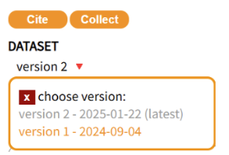

# Updating Deposits

Once you have submitted research data to the 4TU.ResearchData repository, you might subsequently need to update your submission and/or metadata. Updates ensure that your dataset maintains its integrity, accuracy and relevance and enhances other researchers’ ability to find and reuse it. You might also need to update your dataset due to changes to research data policies and guidelines. 

## Update datasets, collections and software by following these steps:

1. In your DASHBOARD, navigate to the "My Datasets" (or “My Collections” to update collection) page.

2. On the ‘Published’ table, find the dataset you want to update.

3. Click the ‘+’ under ‘Actions.’

4. Here, you can edit metadata or files.

5. Click on submit for review.

## Review of updated datasets

When you submit your update, the [data curator](/submission_workflow/data_curation) will review it. Once the review is complete, you may be emailed with comments and suggestions for improvements. If you approve of the changes, you will be emailed confirming that your updated data set has been published.

Any updates to your data set - regardless of how big or small - result in a new version [DOI](/citing_data/dois_and_persistent_identifiers) being assigned to the updated version. 

This means DOIs are versioned and appear as follows: 
- Version numbers are indicated by suffixes such as .v1, .v2, .v3 etc. 
    - This versioning ensures that all changes are tracked and documented
- The base DOI of the published dataset (without version number) will always take you to the latest version of the item. 
- The DOIs of all data set versions are listed and accessible in the drop down menu under the item title 
    - Each DOI version is date-stamped

**If you'd prefer to see the update process in action, this short screencast walks you through each of the steps described above.**

    <iframe src="https://www.youtube.com/embed/-r8CYs5ggUo?si=_xFGmPmoaC4ZLiHj" allowfullscreen="allowfullscreen" allow="autoplay *; geolocation *; microphone *; camera *; midi *; encrypted-media *"></iframe>

 

By following these steps, researchers can ensure their datasets remain current and useful for future research endeavors while maintaining compliance with repository standards.
